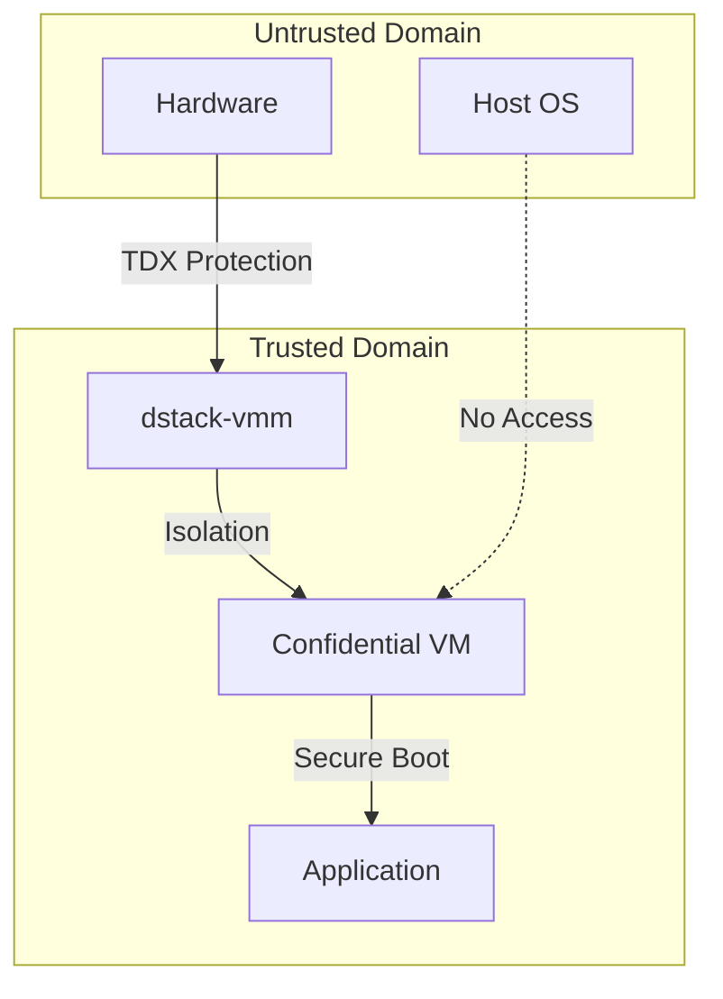

---
title: "VMM Security Architecture"
description: "Analysis of dstack VMM's security boundaries and isolation mechanisms"
---

# VMM Security Architecture

<Callout type="info" icon="server">
**Component**: `dstack-vmm` | [View Source](https://github.com/Dstack-TEE/dstack/tree/master/vmm)
</Callout>

## Overview

The Virtual Machine Manager (VMM) is the critical security boundary between untrusted host infrastructure and confidential workloads. Built on QEMU/KVM with Intel TDX extensions, it provides hardware-enforced memory isolation, secure VM lifecycle management, attestation measurement generation, and resource access mediation through a Rust-based architecture [1](#0-0) .

## Security Model

### Trust Boundaries

### Intel TDX Hardware Security Properties

The VMM leverages Intel TDX (Trust Domain Extensions) for hardware-enforced confidential computing. TDX provides AES-256 memory encryption automatically applied to all guest memory pages, with cryptographic integrity protection preventing unauthorized modification [2](#0-1) . The system implements the q35 machine type with kernel IRQ chip splitting and confidential guest support, ensuring hardware-level isolation between the host and guest domains.

### Measurement and Attestation Framework

The security architecture relies on a comprehensive measurement system using TDX Runtime Measurement Registers (RTMRs). MRTD contains virtual firmware measurements taken by the TDX module in SEAM mode, serving as the trust anchor for all subsequent code execution [3](#0-2) . 

RTMR0 records the CVM's virtual hardware configuration including CPU count and memory specifications. RTMR1 captures Linux kernel measurements, while RTMR2 records kernel command line parameters and initrd measurements. RTMR3 contains runtime application details including compose hash, instance ID, and key provider information, enabling fine-grained application validation [4](#0-3) .

### Cryptographic Key Management Integration

The VMM integrates with the dstack Key Management Service (KMS) for secure key derivation and certificate management. The KMS operates in Local-Key-Provider mode using SGX sealing keys or full KMS mode with blockchain-based authorization [5](#0-4) . Applications receive cryptographically derived keys based on their verified measurements, ensuring that only authenticated workloads can access sensitive cryptographic material.

## Implementation Security Details

### Device Isolation Architecture

The VMM implements a restrictive device model using only paravirtualized drivers to minimize attack surface. All network connectivity uses virtio-net-pci devices with user-mode networking providing automatic NAT isolation [6](#0-5) . Storage access is limited to virtio-blk-pci devices with no direct hardware passthrough except for GPU resources which require VFIO with IOMMU protection [7](#0-6) .

### Memory Security Implementation

Memory isolation is enforced through TDX's hardware encryption capabilities combined with secure Extended Page Tables (EPT). The VMM configures memory backends with hugepage support when GPU resources are allocated, implementing NUMA-aware memory binding for optimal security and performance [8](#0-7) . All guest memory becomes inaccessible to the host after TD finalization, providing cryptographic protection against memory snooping attacks.

### Communication Security Channels

Inter-VM communication is restricted to vhost-vsock-pci devices providing a secure communication channel between host and guest domains [9](#0-8) . The VMM exposes host API services through vsock addressing, enabling secure communication without exposing network interfaces to potential attack vectors [10](#0-9) .

## Attestation and Verification Mechanisms

### TDX Quote Generation and Validation

The attestation system implements comprehensive quote verification using Intel's DCAP Quote Verification Library (QVL). Quote validation includes signature verification, collateral fetching from PCCS servers, and measurement replay to ensure RTMR consistency [11](#0-10) . The system validates TCB attributes to prevent debug mode execution and verifies measurement registers against expected values [12](#0-11) .

### Event Log Integrity Validation

Runtime measurements are validated through event log replay mechanisms that reconstruct RTMR values from recorded events. The system uses SHA-384 hashing for event extension operations, ensuring cryptographic integrity of the measurement chain [13](#0-12) . Event logs are stored in JSON format with cryptographic digests, enabling third-party verification of application execution integrity.

### Blockchain-Based Authorization

The security model integrates with Ethereum-compatible smart contracts for authorization decisions. The KmsAuth contract maintains registries of allowed application measurements, OS images, and KMS instance measurements [14](#0-13) . This provides decentralized trust anchors independent of any single authority, enabling transparent and auditable security policies.

## Resource Protection and DoS Prevention

### Resource Isolation Controls

The VMM implements comprehensive resource limits to prevent resource exhaustion attacks. Maximum allocatable resources are configurable per host, with defaults of 20 vCPUs and 100GB memory per VM [15](#0-14) . Disk space is limited with configurable maximums, and network bandwidth can be controlled through host-level restrictions.

### Input Validation and Sanitization

All VM configuration parameters undergo strict validation before processing. Image names are restricted to alphanumeric characters with specific allowed symbols, and path validation prevents directory traversal attacks [16](#0-15) . GPU device specifications are validated against PCI addressing formats to prevent injection attacks [17](#0-16) .

### API Security and Rate Limiting

The VMM exposes REST APIs through Rocket framework with configurable authentication tokens and rate limiting capabilities [18](#0-17) . API access can be restricted to specific token sets, and the system supports both Unix socket and network-based communication channels for different security requirements.

## Security Verification Procedures

### Measurement Validation Process

Security verification begins with building the base OS image from source code to establish known-good measurements. The dstack-mr tool calculates expected MRTD, RTMR0, RTMR1, and RTMR2 values based on CPU and memory specifications [19](#0-18) . RTMR3 validation requires event log replay to verify application-specific measurements match deployment expectations.

### Cryptographic Chain of Trust

The system implements a hierarchical trust model where the TDX module serves as the hardware root of trust, validating virtual firmware measurements in MRTD. The virtual firmware then measures and validates the Linux kernel, which in turn measures the initramfs and application components [20](#0-19) . This creates an unbroken chain of cryptographic measurements from hardware to application level.

### Third-Party Verification Capabilities

Applications can implement simplified verification by validating KMS-signed certificates rather than performing full quote verification. The KMS maintains root keys registered in blockchain contracts, enabling signature chain validation where applications prove their authenticity through KMS-signed credentials [21](#0-20) . This reduces verification complexity while maintaining cryptographic assurance.

## Integration Security Architecture

### KMS Integration Security

The VMM integrates with KMS instances through RA-TLS connections providing mutual authentication based on TDX quotes. Key derivation uses application-specific identifiers derived from measurements, ensuring cryptographic isolation between different applications even when running on the same host [22](#0-21) . The system supports both ephemeral keys for stateless applications and persistent keys for applications requiring data continuity.

### Gateway Communication Security

External communication flows through the dstack-gateway component which implements TLS termination with certificate validation. The gateway performs quote verification for incoming connections and routes traffic only to verified confidential VMs [23](#0-22) . This provides network-level isolation while enabling external access to authorized applications.

### Certificate Management

TLS certificates are generated through KMS-signed certificate signing requests, creating a PKI hierarchy rooted in hardware-protected keys. The VMM validates certificate chains during connection establishment, ensuring all communications use cryptographically verified endpoints [24](#0-23) . Certificate lifecycle management includes automatic renewal and revocation capabilities.

## Threat Model and Risk Assessment

### Mitigated Attack Vectors

The architecture provides comprehensive protection against memory-based attacks through AES-256 encryption with hardware key management. Hypervisor compromise scenarios are mitigated through TDX measurement validation and attestation requirements. DMA attacks are prevented through IOMMU protection for GPU resources and elimination of direct hardware access for other devices. Side-channel attacks are reduced through limited device exposure and paravirtualized drivers.

### Residual Security Considerations

Timing-based side channel attacks represent ongoing research areas where complete mitigation depends on application-level countermeasures. Power analysis attacks require physical access and hardware-level protections beyond software control. Microarchitectural vulnerabilities may require ongoing microcode updates and hardware mitigations. The security model assumes trusted execution of the TDX module and underlying hardware components.

### Security Monitoring and Incident Response

The system provides comprehensive logging of security-relevant events including VM lifecycle operations, attestation failures, and resource limit violations. Event aggregation enables detection of abnormal patterns that might indicate compromise attempts. The measurement-based architecture enables forensic analysis of security incidents through cryptographic audit trails [25](#0-24) .

## Performance and Security Trade-offs

Memory encryption introduces approximately 5% performance overhead while providing comprehensive protection against host-level attacks. Nested page table operations add minimal overhead while enabling complete memory isolation. Device emulation reduces attack surface compared to hardware passthrough but may impact I/O intensive workloads. Measurement validation requires minimal runtime overhead while providing continuous integrity assurance.

## References and Further Investigation

- [Intel TDX Architecture Specification](https://www.intel.com/content/www/us/en/developer/tools/trust-domain-extensions/documentation.html)
- [QEMU TDX Support Documentation](https://qemu.readthedocs.io/en/latest/system/i386/tdx.html)
- [dstack GitHub Repository](https://github.com/Dstack-TEE/dstack)
- [TDX Quote Verification Library](https://github.com/intel/SGXDataCenterAttestationPrimitives)

  

    <strong>Next Component:</strong> Explore how the VMM integrates with <a href="/docs/security-research/kms-security" className="underline">KMS for secure key management</a> and <a href="/docs/security-research/attestation-architecture" className="underline">attestation verification</a>.
  

## Notes

This security analysis is based on direct examination of the dstack VMM codebase and represents the current implementation as of the analyzed commit. The security model relies heavily on Intel TDX hardware capabilities and assumes proper configuration of the underlying platform. Regular security audits and updates are essential to maintain the security posture as new vulnerabilities are discovered and mitigated. The measurement-based trust model provides strong cryptographic assurance but requires careful validation of expected measurement values during deployment.

## References

- [QEMU TDX Support](https://qemu.readthedocs.io/en/latest/system/i386/tdx.html)
- [KVM TDX Patches](https://lore.kernel.org/kvm/)
- [dstack VMM Design](https://github.com/Dstack-TEE/dstack/blob/master/vmm/DESIGN.md)

  

    <strong>Next Component:</strong> Explore how the VMM integrates with <a href="/docs/security-research/kms-security" className="underline">KMS for secure key management</a>.
  

 