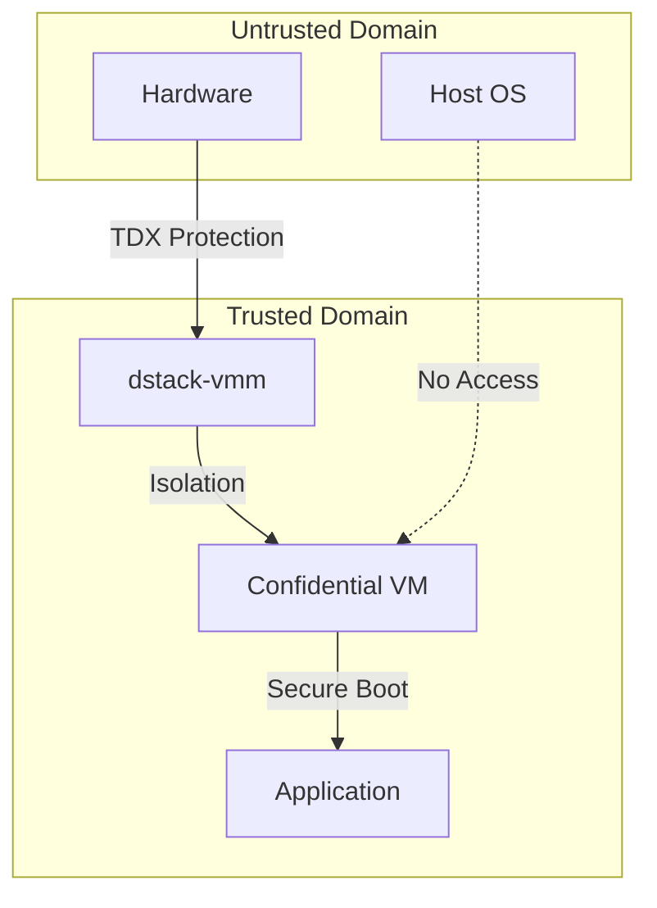

# VMM Security Architecture

`dstack-vmm` ([source](https://github.com/Dstack-TEE/dstack/tree/master/vmm))

## Overview

The `dstack-vmm` serves as the primary security boundary between untrusted host infrastructure and confidential workloads. Its implementation is located in [`vmm/src/main.rs`](https://github.com/Dstack-TEE/dstack/blob/45ebd05a25ad4ffacce3b8f003e4f5a8b609b2e2/vmm/src/main.rs). Built upon QEMU/KVM with Intel TDX extensions, the VMM enforces hardware-backed memory isolation, manages the secure lifecycle of confidential VMs, generates attestation measurements, and mediates resource access—all within a Rust-based architecture designed for robust security guarantees.

## Security Model

### Trust Boundaries

### Intel TDX Hardware Security Properties

The VMM leverages Intel TDX (Trust Domain Extensions) to provide hardware-enforced confidential computing. TDX automatically applies AES-256 memory encryption to all guest memory pages and ensures cryptographic integrity, preventing unauthorized modification. The VMM configures QEMU to use the `q35` machine type with `kernel-irqchip=split` and `confidential-guest-support=tdx`, as demonstrated in the [source code](https://github.com/Dstack-TEE/dstack/blob/45ebd05a25ad4ffacce3b8f003e4f5a8b609b2e2/vmm/src/app/qemu.rs#L320).

### Measurement and Attestation Framework

The security architecture relies on a comprehensive measurement system using TDX Runtime Measurement Registers (RTMRs), as detailed in [the attestation documentation](https://github.com/Dstack-TEE/dstack/blob/45ebd05a/attestation.md#22-determining-expected-mrs). MRTD contains virtual firmware measurements taken by the TDX module in SEAM mode, serving as the trust anchor for all subsequent code execution.

Refer to [attestation.md#22-determining-expected-mrs](https://github.com/Dstack-TEE/dstack/blob/45ebd05a/attestation.md#22-determining-expected-mrs) for specifics on RTMR0–RTMR3 measurement contents.

### Cryptographic Key Management Integration

The VMM integrates with the dstack Key Management Service (KMS) for secure key derivation and certificate management. For a comprehensive overview of supported boot and key management modes, consult the [KMS README overview](https://github.com/Dstack-TEE/dstack/blob/45ebd05a/kms/README.md#overview). dstack supports three boot modes for confidential VMs:

* **Non-KMS Mode**: Stateless, ephemeral keys, no persistent state.
* **Local-Key-Provider Mode**: Stateful, uses SGX sealing keys for persistent app keys, validates key provider via SGX quote.
* **KMS Mode**: Stateful, upgradeable, enables flexible app-id validation and blockchain-based authorization.

In all modes, applications receive cryptographically derived keys based on their verified measurements, ensuring that only authenticated workloads can access sensitive cryptographic material.

## Implementation Security Details

### Device Isolation Architecture

The VMM enforces a restrictive device model by utilizing only paravirtualized drivers, significantly reducing the attack surface. For network connectivity, it exclusively employs `virtio-net-pci` devices configured with user-mode networking, which provides automatic NAT isolation and port forwarding, as implemented in [qemu.rs#L295](https://github.com/Dstack-TEE/dstack/blob/45ebd05a25ad4ffacce3b8f003e4f5a8b609b2e2/vmm/src/app/qemu.rs#L295).

Storage is confined to `virtio-blk-pci` devices, and direct hardware passthrough is not permitted for storage or other peripherals. The sole exception is for GPU resources, which are attached using VFIO and protected by IOMMU, as detailed in [qemu.rs#L427](https://github.com/Dstack-TEE/dstack/blob/45ebd05a25ad4ffacce3b8f003e4f5a8b609b2e2/vmm/src/app/qemu.rs#L427).

### Memory Security Implementation

Memory isolation is enforced by TDX hardware encryption and secure Extended Page Tables (EPT). When GPU resources are attached, the VMM configures memory backends with hugepage support and applies NUMA-aware memory binding to optimize both security and performance. This is implemented in [`qemu.rs#L379`](https://github.com/Dstack-TEE/dstack/blob/45ebd05a25ad4ffacce3b8f003e4f5a8b609b2e2/vmm/src/app/qemu.rs#L379), where the VMM dynamically assigns memory and CPU resources across NUMA nodes based on GPU placement, ensuring that each NUMA node receives dedicated hugepage-backed memory and CPU allocations, and memory is bound to the appropriate host NUMA node for isolation.

After TD finalization, all guest memory is cryptographically protected and becomes inaccessible to the host, preventing memory snooping attacks.

### Communication Security Channels

Inter-VM communication is restricted to `vhost-vsock-pci` devices, which provide a secure communication channel between host and guest domains, as implemented in [qemu.rs#L358](https://github.com/Dstack-TEE/dstack/blob/45ebd05a25ad4ffacce3b8f003e4f5a8b609b2e2/vmm/src/app/qemu.rs#L358).

The VMM exposes host API services to confidential VMs using vsock addressing (see [app.rs#L487](https://github.com/Dstack-TEE/dstack/blob/45ebd05a25ad4ffacce3b8f003e4f5a8b609b2e2/vmm/src/app.rs#L487)), allowing secure communication channels (e.g., `vsock://2:{port}/api`) without exposing network interfaces to the guest or external attack surfaces.

## Attestation and Verification Mechanisms

### TDX Quote Generation and Validation

The dstack attestation system performs quote verification using Intel's DCAP Quote Verification Library (QVL), as implemented in [ra-tls/src/attestation.rs#L304](https://github.com/Dstack-TEE/dstack/blob/45ebd05a25ad4ffacce3b8f003e4f5a8b609b2e2/ra-tls/src/attestation.rs#L304). The verification process includes checking the quote signature, fetching collateral from PCCS servers, and replaying event logs to ensure RTMR values match the reported measurements. If the replayed RTMRs do not match the values in the quote, or if the report data does not match expectations, the verification fails. TCB attributes are also validated to prevent debug mode execution and ensure the integrity of the attestation chain.

The system validates TCB attributes to prevent debug mode execution, following the logic in [ra-tls/src/attestation.rs#L346](https://github.com/Dstack-TEE/dstack/blob/45ebd05a25ad4ffacce3b8f003e4f5a8b609b2e2/ra-tls/src/attestation.rs#L346), and verifies measurement registers against expected values.

### Event Log Integrity Validation

Runtime measurements are validated by replaying event logs to reconstruct the RTMR values, following the logic in [ra-tls/src/attestation.rs#L422](https://github.com/Dstack-TEE/dstack/blob/45ebd05a25ad4ffacce3b8f003e4f5a8b609b2e2/ra-tls/src/attestation.rs#L422). For each RTMR (0–3), the system iterates through the event log, validates each event digest, and extends the measurement using SHA-384 hashing of the previous value and the event digest. This process ensures the cryptographic integrity of the measurement chain. Event logs are stored in JSON format with cryptographic digests, allowing third parties to independently verify application execution integrity.

### Blockchain-Based Authorization

The security model integrates with Ethereum-compatible smart contracts for authorization decisions, as described in the [KMS implementation documentation](https://github.com/Dstack-TEE/dstack/blob/45ebd05a/kms/README.md#kms-implementation). The `KmsAuth` contract maintains registries of allowed application measurements, OS images, and KMS instance measurements. This approach provides decentralized trust anchors independent of any single authority, enabling transparent and auditable security policies.

## Resource Protection and DoS Prevention

### Resource Isolation Controls

The VMM implements strict resource isolation to defend against resource exhaustion attacks. Administrators can configure maximum limits for vCPUs and memory allocated to each VM on a per-host basis, with default values specified in [`vmm.toml#L28`](https://github.com/Dstack-TEE/dstack/blob/45ebd05a25ad4ffacce3b8f003e4f5a8b609b2e2/vmm/vmm.toml#L28). Disk space allocation is also subject to configurable upper bounds, ensuring that no single VM can consume excessive storage. Additionally, network bandwidth usage can be restricted at the host level, providing further protection against denial-of-service scenarios and ensuring fair resource distribution across all VMs.

### Input Validation and Sanitization

All VM configuration parameters are strictly validated before processing. For instance, image names are limited to a maximum of 64 characters, must only contain alphanumeric characters, underscores, hyphens, or periods, and cannot include directory traversal patterns like `..`. This validation logic is implemented as shown in [app.rs#L141](https://github.com/Dstack-TEE/dstack/blob/45ebd05a25ad4ffacce3b8f003e4f5a8b609b2e2/vmm/src/app.rs#L141). These checks prevent invalid or malicious image names and block directory traversal attacks.

GPU device specifications are validated against PCI addressing formats to prevent injection attacks, following the logic in \[qemu.rs#L558]\([https://github.com/Dstack-TEE/dstack/blob/45ebd05a25](https://github.com/Dstack-TEE/dstack/blob/45ebd05a25)
### API Security and Rate Limiting

The VMM exposes REST APIs through the Rocket framework, with support for authentication tokens and rate limiting as specified in [`vmm.toml#L62C1-L64C12`](https://github.com/Dstack-TEE/dstack/blob/45ebd05a25ad4ffacce3b8f003e4f5a8b609b2e2/vmm/vmm.toml#L62C1-L64C12). Authentication can be enabled or disabled, and tokens are defined in the `[auth]` section of the configuration file.

API access is restricted to specific token sets, and the system offers both Unix socket and network-based communication channels to support various deployment security requirements.

## Security Verification Procedures

### Measurement Validation Process

Security verification begins by building the base OS image from source, establishing known-good measurement values. The [dstack-mr tool](https://github.com/Dstack-TEE/dstack/blob/45ebd05a/attestation.md#22-determining-expected-mrs) is used to calculate expected values for MRTD, RTMR0, RTMR1, and RTMR2, based on the chosen CPU and memory configuration. RTMR3 validation is performed by replaying the event log, ensuring that application-specific measurements are consistent with deployment expectations.

### Cryptographic Chain of Trust

The system implements a hierarchical trust model. The TDX module serves as the hardware root of trust, validating virtual firmware measurements stored in MRTD. The virtual firmware then measures and verifies the Linux kernel, which subsequently measures the initramfs and application components. This creates an unbroken, cryptographically verifiable chain of trust, from hardware all the way up to the application layer. For more detail on the measurement and attestation process, see the [attestation documentation](https://github.com/Dstack-TEE/dstack/blob/45ebd05a/attestation.md).

### Third-Party Verification Capabilities

Applications can use simplified verification by validating KMS-signed certificates, instead of performing full quote verification. The KMS maintains root keys registered in blockchain contracts, supporting signature chain validation—so applications can prove authenticity using KMS-signed credentials. For more on this process, see [validating apps via the KMS auth chain](https://github.com/Dstack-TEE/dstack/blob/45ebd05a/kms/README.md#validating-apps-via-the-kms-auth-chain). This approach reduces verification complexity while still maintaining cryptographic assurance.

## Integration Security Architecture

### KMS Integration Security

The VMM integrates with KMS instances using RA-TLS connections, enabling mutual authentication using TDX quotes. Key derivation uses application-specific identifiers derived from TDX measurements, ensuring cryptographic isolation even for applications running on the same host. For a full explanation of the key derivation process and API usage, see the [getAppKey documentation](https://github.com/Dstack-TEE/dstack/blob/45ebd05a/kms/README.md#getappkey). The platform supports both ephemeral keys for stateless workloads and persistent keys for applications that require continuity.

### Gateway Communication Security

All external communication is routed through the dstack-gateway component, which manages TLS termination and certificate validation. Gateway endpoints are selected dynamically based on the VM and host configuration, following the logic in [app.rs#L467](https://github.com/Dstack-TEE/dstack/blob/45ebd05a25ad4ffacce3b8f003e4f5a8b609b2e2/vmm/src/app.rs#L467). The gateway verifies TDX quotes for all incoming connections and only forwards traffic to confidential VMs that have successfully attested. This provides strong network-level isolation while enabling external access to authorized workloads.

### Certificate Management

TLS certificates are generated via KMS-signed certificate signing requests, creating a PKI hierarchy rooted in hardware-protected keys. The VMM validates certificate chains during connection setup to ensure that all endpoints are cryptographically authenticated. Certificate lifecycle management—including automatic renewal and revocation—is managed through the KMS RPC interface (see [the rpc interface documentation](https://github.com/Dstack-TEE/dstack/blob/45ebd05a/kms/README.md#the-rpc-interface)).

## Threat Model and Risk Assessment

### Mitigated Attack Vectors

This architecture offers comprehensive protection against memory-based attacks by enforcing AES-256 encryption and hardware key management. Hypervisor compromise is mitigated through TDX measurement validation and strict attestation requirements. DMA attacks are prevented using IOMMU for GPU resources and by eliminating direct hardware access for other devices. Exposure to side-channel attacks is minimized by the exclusive use of paravirtualized drivers and limited device exposure.

### Residual Security Considerations

Some residual risks remain. Timing-based side-channel attacks are an ongoing area of research and may require application-level countermeasures. Power analysis attacks require physical access and are largely outside the scope of software-based protections. Microarchitectural vulnerabilities must be addressed with continual microcode and hardware updates. The security model assumes trusted execution of the TDX module and underlying platform hardware.

### Security Monitoring and Incident Response

The VMM implements detailed logging of security-relevant events—including VM lifecycle changes, attestation failures, and resource limit violations—via the [`vm_event_report`](https://github.com/Dstack-TEE/dstack/blob/45ebd05a25ad4ffacce3b8f003e4f5a8b609b2e2/vmm/src/app.rs#L376) function. This system records events, enforces limits on event body size, and tracks types such as `boot.progress`, `boot.error`, and `shutdown.progress` for each VM. Unknown or malformed events are logged for further investigation. Aggregated logs enable detection of abnormal patterns that could indicate compromise attempts. The measurement-based architecture ensures cryptographic audit trails for effective forensic analysis.

## Performance and Security Trade-offs

Memory encryption with TDX introduces an estimated 5% performance overhead, but provides strong protection against host-level attacks. Nested page tables offer robust memory isolation with minimal additional overhead. Device emulation reduces attack surface compared to hardware passthrough, though it can affect performance for I/O-intensive workloads. Measurement validation incurs only minimal runtime overhead, ensuring continuous integrity without major impact.

## References and Further Investigation

- [Intel TDX Architecture Specification](https://www.intel.com/content/www/us/en/developer/tools/trust-domain-extensions/documentation.html)
- [QEMU TDX Support Documentation](https://qemu.readthedocs.io/en/latest/system/i386/tdx.html)
- [KVM TDX Patches](https://lore.kernel.org/kvm/)
- [dstack GitHub Repository](https://github.com/Dstack-TEE/dstack)
- [dstack VMM Design](https://github.com/Dstack-TEE/dstack/blob/master/vmm/DESIGN.md)
- [TDX Quote Verification Library](https://github.com/intel/SGXDataCenterAttestationPrimitives)

  

    <strong>Next Component:</strong> Explore how the VMM integrates with <a href="/docs/security-research/kms-security" className="underline">KMS for secure key management</a> and <a href="/docs/security-research/attestation-architecture" className="underline">attestation verification</a>.
  

