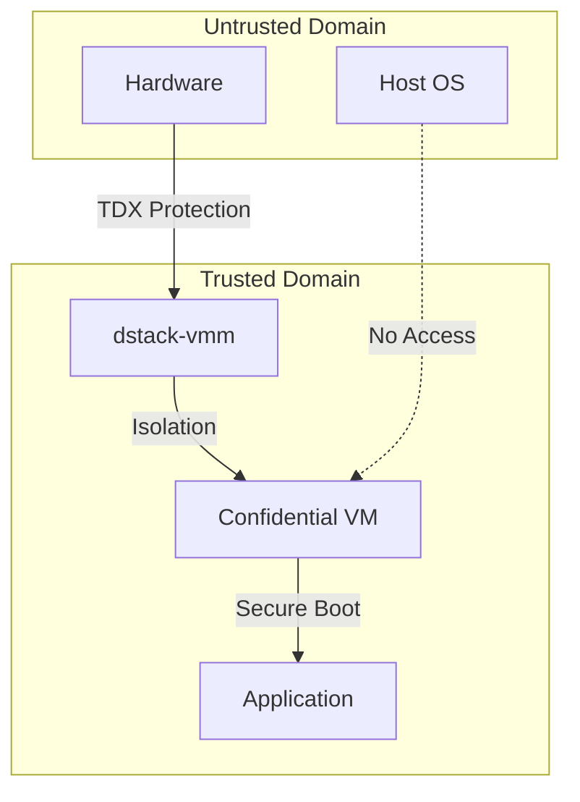

# VMM Security Architecture

The Virtual Machine Monitor (VMM) is the heart of dStack's confidential computing platform. Acting as the central orchestrator, the VMM manages the lifecycle, security, and resource allocation of Confidential Virtual Machines (CVMs) running in secure execution environments enabled by Intel Trust Domain Extensions (TDX). Its mission is to create a robust, hardware-enforced boundary between untrusted host infrastructure and sensitive workloads, ensuring that only trusted code can execute and access protected data.

## What is dStack-VMM?

dStack-vmm is a Rust-based, security-focused hypervisor management layer. It abstracts the complexity of deploying containerized applications within hardware-enforced trusted boundaries, providing unified mechanisms for VM provisioning, attestation, and operational control. The VMM integrates with key security services, including cryptographic measurement and attestation workflows (via dstack-kms), and ensures secure connectivity through the dstack-gateway. Its interfaces span RPC, web consoles, and CLI, enabling both automated and interactive management for confidential computing environments.

## Why is VMM Security Critical?

In confidential computing, the VMM is the primary security boundary. It must defend against a wide range of threats, from malicious host software to advanced side-channel attacks. By leveraging Intel TDX, the VMM enforces hardware-backed memory isolation, cryptographic measurement, and attestation, ensuring that only verified and untampered environments can run sensitive workloads. This architecture is designed to provide strong security guarantees even in the presence of potentially compromised host systems.

## Key Features
- **Hardware-rooted trust:** Built on Intel TDX, providing AES-256 memory encryption, CPU-state isolation, and address-translation integrity.
- **Comprehensive attestation:** Every stage of the VM lifecycle is measured and attested, creating a cryptographically verifiable chain of trust.
- **Flexible key management:** Integrates with dstack-kms for policy-driven key provisioning and certificate management.
- **Resource and device isolation:** Restricts device models and enforces strict resource controls to minimize attack surface.
- **Auditability and monitoring:** Detailed logging and event reporting enable forensic analysis and incident response.

> This overview sets the stage for a deep dive into each architectural and security component of dStack's VMM. Continue reading the following sections for a comprehensive understanding of how each layer contributes to the overall security model.

## Overview

The `dstack-vmm` serves as the primary security boundary between untrusted host infrastructure and confidential workloads. Its implementation is located in [`vmm/src/main.rs`](https://github.com/Dstack-TEE/dstack/blob/45ebd05a25ad4ffacce3b8f003e4f5a8b609b2e2/vmm/src/main.rs). Built upon QEMU/KVM with Intel TDX extensions, the VMM enforces hardware-backed memory isolation, manages the secure lifecycle of confidential VMs, generates attestation measurements, and mediates resource access—all within a Rust-based architecture designed for robust security guarantees.


---

## Security Model

### Trust Boundaries

*The security model for dstack-vmm is built around strict trust boundaries that separate the untrusted host environment from the confidential workloads running inside secure virtual machines. This model ensures that only the components within the trusted domain—protected by hardware-based isolation—can access sensitive data and operations, while the host and hardware outside this boundary are treated as untrusted. The following diagram illustrates these boundaries and the protections in place:*




### Intel TDX Hardware Security Properties

The VMM leverages Intel TDX (Trust Domain Extensions) to provide hardware-enforced confidential computing. TDX automatically applies AES-256 memory encryption to all guest memory pages and ensures cryptographic integrity, preventing unauthorized modification ([Intel TDX Whitepaper §3.2](https://www.intel.com/content/dam/develop/external/us/en/documents/tdx-whitepaper-final9-17.pdf?utm_source=chatgpt.com)).

Beyond memory encryption, TDX enforces CPU-state isolation by capturing the full register context inside Secure Arbitration Mode (SEAM) and preventing any host-initiated register inspection or tampering during VM exits and entries ([Linux Kernel TDX Documentation](https://www.kernel.org/doc/html/next/x86/tdx.html?utm_source=chatgpt.com)). Address-Translation Integrity protects the guest's page tables against injection or replay attacks by verifying each update through the Runtime TDX Measurement Registers (RTMRs), which accumulate progressive hashes of firmware, bootloader, kernel, and critical components into a measured-boot chain of trust ([Intel Trust Authority – TD Integrity](https://docs.trustauthority.intel.com/main/articles/concept-td-integrity.html?utm_source=chatgpt.com)).

To instantiate a TDX-protected CVM in QEMU, the VMM configures the VM to use the `q35` machine type—a modern Intel ICH9-style chipset emulation that supports PCI-Express, LPC, and all device models required for confidential computing. Legacy platforms like `i440fx` or `microvm` lack the necessary PCIe infrastructure and cannot host TDX guests ([Intel TDX Whitepaper §2.3](https://cdrdv2-public.intel.com/690419/TDX-Whitepaper-February2022.pdf?utm_source=chatgpt.com); [Wikipedia: Trust Domain Extensions](https://en.wikipedia.org/wiki/Trust_Domain_Extensions?utm_source=chatgpt.com)).

In Dstack's QEMU wrapper (see [`vmm/src/app/qemu.rs` at commit 45ebd05…#L320](https://github.com/Dstack-TEE/dstack/blob/45ebd05a25ad4ffacce3b8f003e4f5a8b609b2e2/vmm/src/app/qemu.rs#L320)), the invocation appears as:

```rust
command
    .arg("-machine")
    .arg("q35,kernel-irqchip=split,confidential-guest-support=tdx,hpet=off");

let tdx_object = if cfg.use_mrconfigid {
    // Compute mrconfigid for attestation binding...
    format!("tdx-guest,id=tdx,mrconfigid={mrconfigid}")
} else {
    "tdx-guest,id=tdx".to_string()
};
command.arg("-object").arg(tdx_object);
```

* **`confidential-guest-support=tdx`** engages the TDX firmware interface.
* **`kernel-irqchip=split`** offloads interrupt emulation to the kernel's KVM module for precise delivery under SEAM protection.
* **`hpet=off`** disables legacy timers that can conflict with TDX's secure interrupt handling.
* **`-object tdx-guest,id=tdx[,mrconfigid=…]`** initializes the Intel TDX guest context and, if supplied, binds the computed MRCONFIGID for attestation.

Finally, the VMM integrates with **dstack-kms** to automate remote attestation: it retrieves Intel TDX quotes—cryptographically signed bundles that bind the RTMR measurement chain to a public key—allowing external verifiers to validate the CVM's boot sequence and runtime integrity before provisioning secrets. By combining AES-XTS memory encryption, SHA-3 MAC integrity, CPU-state isolation, address-translation integrity, and end-to-end attestation, Intel TDX provides a robust hardware-rooted security foundation that the Dstack VMM orchestrates for confidential computing environments.
