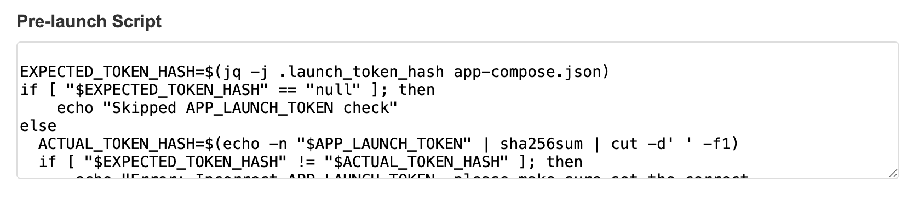
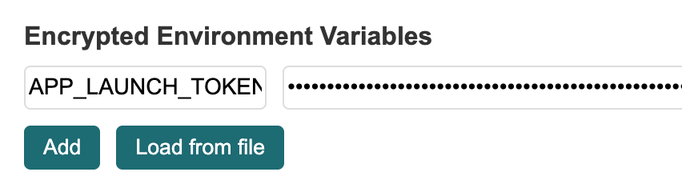

# dstack Production Security Best Practices

This document describes security considerations for deploying dstack apps in production.

## Security Audit

dstack has been audited by [zkSecurity](https://www.zksecurity.xyz/). The audit covered the KMS, guest agent, and attestation verification components. See the [full audit report](./dstack-audit.pdf) for findings and remediation status.

## Always pin image hash in your docker-compose.yaml

When deploying applications in a TEE environment, it's critical to ensure the integrity and immutability of your container images. Using image digests (SHA256 hashes) instead of tags cryptographically ensures that the exact same image is always pulled, preventing supply chain attacks. This proves to users that your App is anchored to a specific code version.

❌ Bad example:

```yaml
services:
  nginx:
    image: nginx:latest
```

```yaml
services:
  nginx:
    image: nginx:1.27.5
```

✅ Good example:

```yaml
services:
  nginx:
    image: nginx@sha256:eee5eae48e79b2e75178328c7c585b89d676eaae616f03f9a1813aaed820745a
```

## Reproducibility

If your App is intended for end users who need to verify what code your App is running, then the verifiability of Docker images is crucial. dstack anchors the code running inside the CVM through the hash of app-compose.json. However, at the same time, the App needs to provide users with a reproducible build method. There are multiple ways to achieve reproducible image builds, and dstack provides a reference example: [dstack-ingress](https://github.com/Dstack-TEE/dstack-examples/tree/main/custom-domain/dstack-ingress)

## Authenticated envs and user_config

dstack provides encrypted environment variable functionality. Although the CVM physical machine controller cannot view encrypted environment variables, they may forge encrypted environment variables because the CVM encryption public key is known to everyone. Therefore, Apps need to perform auth checks on encrypted environment variables at the application layer. LAUNCH_TOKEN pattern is one method to prevent unauthorized envs replacement. For details, refer to the deployment script of [dstack-gateway](https://github.com/Dstack-TEE/dstack/blob/1b8a4516826b02f9d7f747eddac244dcd68fc325/gateway/dstack-app/deploy-to-vmm.sh#L150-L165).

Newer dstack OS images support the LAUNCH_TOKEN pattern natively via `requirements.launch_token_hash` in app-compose.json. When this field is set, the guest reads the launch token from `user_config` at JSON path `dstack.launch_token` and refuses to boot — before any keys are provisioned — unless its digest matches the hash pinned in the (compose-hash-measured) app-compose.json. When the field is absent, `user_config` is not parsed and stays fully application-defined. Set manifest_version to `"3"` (string) when using `requirements` so older guests fail closed instead of silently ignoring it.

The digest is domain-separated so it stays distinct from the legacy plain-`sha256(token)` convention and from generic precomputed tables:

```bash
LAUNCH_TOKEN_HASH=$(printf 'dstack-launch-token/v1:%s' "$TOKEN" | sha256sum | cut -d' ' -f1)
```

Because `launch_token_hash` is public, a guessable token can be recovered offline by brute force. Guests reject tokens shorter than 32 bytes, but length alone does not guarantee entropy — always generate the token randomly, e.g. `tr -dc 'a-zA-Z0-9' < /dev/urandom | head -c 32`.

Also understand the protection boundary of this mechanism: the guest verifies the token before any keys are provisioned, which means the token must reach the guest through `user_config` — a channel the host can read. The requirement therefore stops parties who only know the public app-compose.json from launching the app, but once a host has hosted a deployment it learns the token and can later relaunch instances of that compose with substituted encrypted envs. Mitigations: generate a fresh token per deployment and remove stale compose hashes from the on-chain whitelist; if the token must stay secret from the host, use the app-layer `APP_LAUNCH_TOKEN` encrypted-env pattern above instead (its check necessarily runs after key provisioning).

If you use dstack-vmm's built-in UI, the prelaunch script has already been automatically filled in for you:



You only need to add the `APP_LAUNCH_TOKEN` environment variable to enable LAUNCH_TOKEN checking.



`user_config` is not encrypted, and similarly requires integrity checks at the application layer. For example, you can store a `USER_CONFIG_HASH` in encrypted environment variables and verify it in the `pre_launch_script`. Such a check is a defense-in-depth measure, not a gate: it does not reliably run before your containers do (see the next section), so the authoritative check belongs in `init_script` or in the application itself.

## Security semantics must not depend on `pre_launch_script` running first

`pre_launch_script` runs from `app-compose.service`, which is ordered `After=docker.service`. Docker restores containers when the daemon starts, so on a reboot your application can already be running by the time the prelaunch script executes:

- **`restart: always`** — Docker restarts the container whenever the daemon starts, even if it was stopped cleanly beforehand. Every reboot takes this path. This is the restart policy used in several dstack examples.
- **`restart: unless-stopped`** — a clean shutdown runs the `ExecStop` of `app-compose.service`, which stops the containers, so Docker does not restore them. But an unclean stop (host reset, guest crash, power loss) leaves them in the running state and Docker restores them on the next boot. The host decides when to reset a CVM, so it can force this path at will.

`init_script` has no such gap. It runs from `dstack-prepare.service`, which is ordered `Before=docker.service`, so every init script completes before dockerd — and therefore before any container — starts, on every boot. Init scripts also run after `dstack-util setup`, so app keys and the decrypted env file are already available to them. Anything that must run before application code belongs in `init_script`.

This is an ordering property, not an integrity one. Both scripts are measured into the compose hash, so the scripts you audited are the scripts that run. What is not guaranteed is that the prelaunch one runs *first*.

**Unsafe in `pre_launch_script`:**

- Verifying `USER_CONFIG_HASH` or an `APP_LAUNCH_TOKEN` and calling `exit 1` to abort the launch. After a reboot the app is already serving with the unverified input; the non-zero exit only marks `app-compose.service` as failed.
- Fetching or integrity-checking a data file, model weights, or a database snapshot before the app consumes it. The restored container may already have read the previous, unchecked copy.
- Installing firewall rules, network namespaces, or an egress proxy that is meant to contain the application. There is a window in which the app runs unconstrained.
- Deriving or writing a secret that the app expects to find on disk. On the early-start path the app sees whatever the previous boot left there.

**Safe in `pre_launch_script`:** work whose only effect is on the `docker compose up` that immediately follows it — pre-pulling or importing images, generating a compose override, or writing files that containers pick up only when that compose run recreates them.

**For app auditors:** treat any check in a `pre_launch_script` as advisory. When judging whether a deployment enforces a security property, ask whether the property still holds on a boot where the prelaunch script has not run yet. If it does not, the check must move into `init_script`, or into the application itself before it serves traffic or touches secrets.

## Don't put secrets in docker-compose.yaml

CVM needs to ensure verifiability, so app-compose.json is public by default, containing the prelaunch script and docker-compose.yaml.
You should not put secrets in docker-compose.yaml for best security practice. Use encrypted environment variables instead.

In case by any chance you really do not want to expose your compose file, you can disable exposing app-compose.json by setting public_tcbinfo=false in app-compose.json.
Example app-compose.json:

```json
{
    ...
    "public_tcbinfo": false
    ...
}
```

**But keep in mind, even if you disable exposing app-compose.json, it is just hidden from the public API, the physical machine controller can still access it on the file system.**

## Do not use development trust settings in production

Development settings are intentionally easy to audit, but they are not production-safe. A production deployment should satisfy all of the following:

- The KMS attests its own RPC certificate. Do not deploy production KMS with `attest_rpc_cert = false`.
- KMS authorization uses webhook/on-chain policy. Do not use `auth_api.type = "dev"` with real key material.
- The KMS contract pins a concrete gateway app id. Do not use `gateway_app_id = "any"` for production traffic.
- TEE quotes are evaluated by deployment policy, including TCB status and expected OS/application measurements.

The KMS TLS listener verifies client certificates by the attestation they carry rather than by an issuer CA, so it needs no `rpc.tls.mutual` section. It still accepts connections without a client certificate, because bootstrap and public metadata endpoints must be reachable before a client has an RA-TLS certificate. `GetTempCaCert` remains in use by guests and by KMS-to-KMS onboarding, which still mint their client certificates from that CA; it returns temp CA private material, so treat it as bootstrap-sensitive.

App key release and KMS key handover still require verified caller attestation from the RA-TLS client certificate. Certificate signing verifies the CSR signature and embedded attestation before signing.

## Management/admin API authentication

The VMM, gateway, and KMS management surfaces must have authentication enabled in production:

- VMM: set `[auth] enabled = true` with `tokens` (or `htpasswd_file`) — this guards the entire VMM HTTP/pRPC/UI surface. Never bind to a non-localhost address without it. Clients send `Authorization: Bearer <token>` or `X-Admin-Token`.
- Gateway: set `[core.admin] admin_token` (or `htpasswd_file`) and keep `insecure_no_auth = false`. Clients send `Authorization: Bearer <token>` or `X-Admin-Token`.
- KMS: enable `[core.admin]` with an `auth_token` (or `htpasswd_file`); the admin RPCs are served on a dedicated listener and clients send `Authorization: Bearer <token>` or `X-Admin-Token`. Enabled with no credential denies all admin RPCs (fail-closed).

All three share the same HTTP authenticator: bcrypt-only htpasswd (via `htpasswd -B`), constant-time token comparison, and fail-closed behavior.

## Keep private material owner-only

Secret-bearing files should be owner-only (`0600`) wherever possible, including app keys, decrypted env files, KMS root keys, gateway WireGuard/TLS keys, and ACME credentials. Preserve restrictive permissions when copying volumes, backing up `/etc/kms/certs`, or moving gateway and certbot state between hosts. Public issue [#606](https://github.com/Dstack-TEE/dstack/issues/606) tracks the remaining low-cost hardening work in dstack-managed file writes.

## docker logs is public available by default

Similarly, to facilitate App observability, docker logs are public by default. You can disable exposing docker logs by setting public_logs=false.
Example app-compose.json:

```json
{
    ...
    "public_logs": false
    ...
}
```

## Don't expose unexpected ports

In dstack CVM, dstack-guest-agent listens on port 8090, allowing public access to basic CVM information.

In docker-compose.yaml, all declared ports will be exposed to the public internet. Do not expose unnecessary ports.

For example:

```yaml
# This will expose port 80 to the public
services:
  nginx:
    image: nginx@sha256:eee5eae48e79b2e75178328c7c585b89d676eaae616f03f9a1813aaed820745a
    ports:
      - "80:80"
```

```yaml
# This will not expose port 80 to the public
services:
  nginx:
    image: nginx@sha256:eee5eae48e79b2e75178328c7c585b89d676eaae616f03f9a1813aaed820745a
```

```yaml
# This will not expose port 80 to the public
services:
  nginx:
    image: nginx@sha256:eee5eae48e79b2e75178328c7c585b89d676eaae616f03f9a1813aaed820745a
    ports:
      - "127.0.0.1:80:80"
```

Note that when setting network_mode: host, all ports listened to within the container will be exposed to the public internet.

```yaml
# This will expose port 80 to the public
services:
  nginx:
    image: nginx@sha256:eee5eae48e79b2e75178328c7c585b89d676eaae616f03f9a1813aaed820745a
    network_mode: host
```
## Runtime event-log V2 policies

Event-log V2 exposes canonical digest pre-images so a relying party can check
individual claims such as `compose-hash`. Verifying
`sha384(preimage) == digest` proves only that those bytes participate in the
quoted RTMR/PCR extension chain. It does **not** prove that trusted dstack boot
code originated the event name: privileged code inside the CVM can append
additional measured events after boot.

Policies that trust a named V2 event must therefore also validate ordering and
the boot boundary. In particular, select the expected claim before
`boot-mr-done`/`system-ready`, reject duplicate trusted claim names, and replay
the complete quoted chain. Never accept an arbitrary later event solely because
its digest matches its supplied pre-image.

V2 is a coordinated upgrade. Upgrade every KMS, gateway, verifier, and other
relying party before enabling `event_log_version: 2`; older verifiers interpret
runtime events as V1 and reject the quote. Older guest images may ignore the
compose field and emit V1 events, so confirm that the selected image advertises
V2 support before relying on per-event claims.
