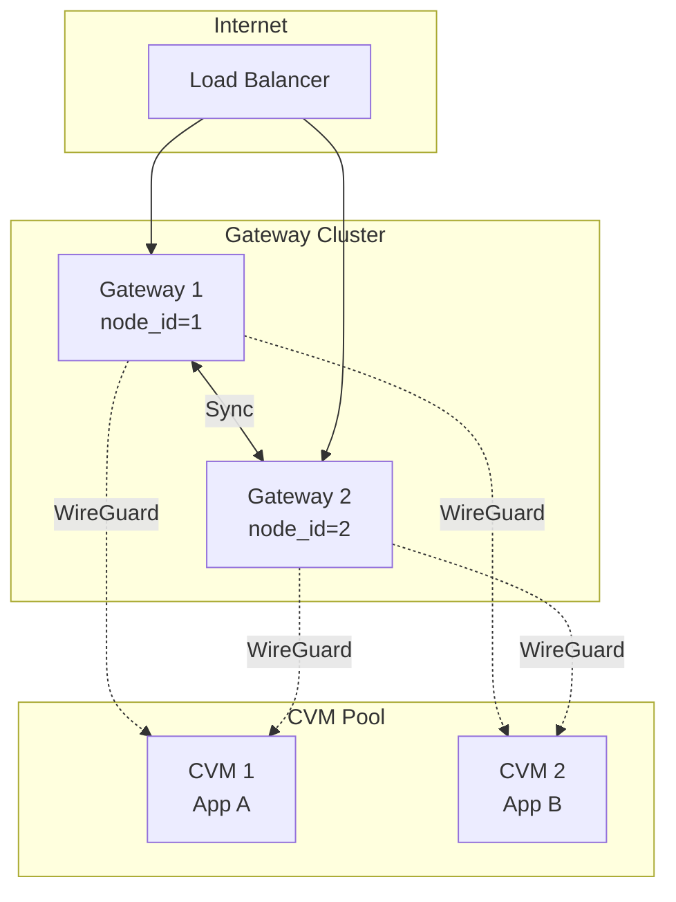

# dstack-gateway Cluster Deployment Guide

This document describes how to deploy a dstack-gateway cluster, including single-node and multi-node configurations.

## Table of Contents

1. [Overview](#1-overview)
2. [Cluster Deployment (2-Node Example)](#2-cluster-deployment-2-node-example)
3. [Adding Reverse Proxy Domains](#3-adding-reverse-proxy-domains)
4. [Operations and Monitoring](#4-operations-and-monitoring)

## 1. Overview

dstack-gateway is a distributed reverse proxy gateway for dstack services. Key features include:

- TLS termination and SNI routing: Automatically selects certificates and routes traffic based on SNI
- Automatic certificate management: Automatically requests and renews certificates via ACME protocol (Let's Encrypt)
- Multi-node cluster: Multiple gateway nodes automatically sync state for high availability
- WireGuard tunnels: Provides secure network access for CVM instances

### Architecture Diagram



When a CVM starts, it registers with one of the Gateways. The Gateway cluster automatically syncs the CVM's information (including WireGuard public key), enabling all Gateway nodes to establish WireGuard tunnel connections to that CVM.

### Port Description

| Default Port | Protocol | Purpose | Security Recommendation |
|--------------|----------|---------|-------------------------|
| 9012 | HTTPS | RPC port for inter-node sync communication | Internal network only |
| 9013 | UDP | WireGuard tunnel port | Internal network only |
| 9014 | HTTPS | Proxy port for external TLS proxy service | Can be exposed to public |
| 9015 | HTTP | Debug port for health checks and debugging | Must be disabled in production |
| 9016 | HTTP | Admin port for management API | Do not expose to public, recommend using Unix Domain Socket |

Production security configuration example:

```toml
[core.debug]
insecure_enable_debug_rpc = false  # Disable Debug port

[core.admin]
enabled = true
address = "unix:/run/dstack/admin.sock"  # Use Unix Domain Socket
```

## 2. Cluster Deployment (2-Node Example)

### 2.1 Node Planning

| Node | node_id | Gateway IP | Client IP range | bootnode |
|------|---------|------------|-----------------|----------|
| gateway-1 | 1 | 10.8.128.1/16 | 10.8.128.0/18 | gateway-2 |
| gateway-2 | 2 | 10.8.0.1/16 | 10.8.0.0/18 | gateway-1 |

Notes:
- Each node's node_id must be unique
- Each node's Client IP range should not overlap (used for allocating IPs to different CVMs)
- bootnode is configured as another node's RPC URL, used for cluster discovery at startup

### 2.2 CIDR Description

Client IP range (/18):
- /18 means the first 18 bits are the network prefix
- For example, 10.8.128.0/18 covers the address range 10.8.128.0 ~ 10.8.191.255
- Each Gateway's /18 range does not overlap, so each Gateway can allocate IPs locally without syncing with other Gateways

Gateway IP (/16):
- Gateway IP uses /16 netmask to allow network routing to cover the larger 10.8.0.0/16 address space
- This way, when another Gateway allocates an address in a /18 subnet, traffic can still be correctly routed

### 2.3 WireGuard Configuration Fields

Key fields in the `[core.wg]` section:

- `ip`: Gateway's own WireGuard address in CIDR format (e.g., 10.8.128.1/16)
- `client_ip_range`: Address pool range for allocating to CVMs (e.g., 10.8.128.0/18)
- `reserved_net`: Reserved address range that will not be allocated to CVMs (e.g., 10.8.128.1/32, reserving the gateway's own address)

Recommendation: Design client_ip_range and reserved_net to ensure clear address pool planning for each Gateway, avoiding address conflicts.

### 2.4 Configuration File Examples

gateway-1.toml:

```toml
log_level = "info"
address = "0.0.0.0"
port = 9012

[tls]
key = "/var/lib/gateway/certs/gateway-rpc.key"
certs = "/var/lib/gateway/certs/gateway-rpc.cert"

[tls.mutual]
ca_certs = "/var/lib/gateway/certs/gateway-ca.cert"
mandatory = false

[core]
kms_url = "https://kms.demo.dstack.org"
rpc_domain = "rpc.gateway-1.demo.dstack.org"

[core.admin]
enabled = true
port = 9016
address = "0.0.0.0"

[core.debug]
insecure_enable_debug_rpc = true
insecure_skip_attestation = false
port = 9015
address = "0.0.0.0"

[core.sync]
enabled = true
interval = "30s"
timeout = "60s"
my_url = "https://rpc.gateway-1.demo.dstack.org:9012"
bootnode = "https://rpc.gateway-2.demo.dstack.org:9012"
node_id = 1
data_dir = "/var/lib/gateway/data"

[core.wg]
private_key = "<node1-private-key>"
public_key = "<node1-public-key>"
listen_port = 9013
ip = "10.8.128.1/16"
reserved_net = ["10.8.128.1/32"]
client_ip_range = "10.8.128.0/18"
config_path = "/var/lib/gateway/wg.conf"
interface = "wg-gw1"
endpoint = "<host ip>:9013"

[core.proxy]
listen_addr = "0.0.0.0"
listen_port = 9014
external_port = 443
```

gateway-2.toml:

```toml
log_level = "info"
address = "0.0.0.0"
port = 9012

[tls]
key = "/var/lib/gateway/certs/gateway-rpc.key"
certs = "/var/lib/gateway/certs/gateway-rpc.cert"

[tls.mutual]
ca_certs = "/var/lib/gateway/certs/gateway-ca.cert"
mandatory = false

[core]
kms_url = "https://kms.demo.dstack.org"
rpc_domain = "rpc.gateway-2.demo.dstack.org"

[core.admin]
enabled = true
port = 9016
address = "0.0.0.0"

[core.debug]
insecure_enable_debug_rpc = true
insecure_skip_attestation = false
port = 9015
address = "0.0.0.0"

[core.sync]
enabled = true
interval = "30s"
timeout = "60s"
my_url = "https://rpc.gateway-2.demo.dstack.org:9012"
bootnode = "https://rpc.gateway-1.demo.dstack.org:9012"
node_id = 2
data_dir = "/var/lib/gateway/data"

[core.wg]
private_key = "<node2-private-key>"
public_key = "<node2-public-key>"
listen_port = 9013
ip = "10.8.0.1/16"
reserved_net = ["10.8.0.1/32"]
client_ip_range = "10.8.0.0/18"
config_path = "/var/lib/gateway/wg.conf"
interface = "wg-gw2"
endpoint = "<host ip>:9013"

[core.proxy]
listen_addr = "0.0.0.0"
listen_port = 9014
external_port = 443
```

### 2.5 Verify Cluster Sync

```bash
# Check sync status on any node
curl -s http://localhost:9016/prpc/Admin.WaveKvStatus | jq .
```

## 3. Adding Reverse Proxy Domains

Gateway supports automatic TLS certificate management via the ACME protocol.

### 3.1 Configure ACME Service

```bash
# Set ACME URL (Let's Encrypt production)
curl -X POST "http://localhost:9016/prpc/Admin.SetCertbotConfig" \
  -H "Content-Type: application/json" \
  -d '{"acme_url": "https://acme-v02.api.letsencrypt.org/directory"}'

# For testing, use Let's Encrypt Staging
# "acme_url": "https://acme-staging-v02.api.letsencrypt.org/directory"
```

### 3.2 Configure DNS Credential

Gateway uses DNS-01 validation, which requires configuring DNS provider API credentials.

Cloudflare example:

```bash
curl -X POST "http://localhost:9016/prpc/Admin.CreateDnsCredential" \
  -H "Content-Type: application/json" \
  -d '{
    "name": "cloudflare-prod",
    "provider_type": "cloudflare",
    "cf_api_token": "your-cloudflare-api-token",
    "set_as_default": true
  }'
```

### 3.3 Add Domain

Call the Admin.AddZtDomain API to add a domain. Gateway will automatically request a *.domain wildcard certificate.

Parameter description:

| Parameter | Type | Required | Description |
|-----------|------|----------|-------------|
| domain | string | Yes | Base domain (e.g., example.com), certificate will be issued for *.example.com |
| port | uint32 | Yes | External service port for this domain (usually 443) |
| dns_cred_id | string | No | DNS credential ID, leave empty to use default credential |
| node | uint32 | No | Bind to specific node (node_id), leave empty for any node to serve this domain |
| priority | int32 | No | Priority for selecting default base_domain (higher value = higher priority, default is 0) |

Basic usage (using default DNS credential):

```bash
curl -X POST "http://localhost:9016/prpc/Admin.AddZtDomain" \
  -H "Content-Type: application/json" \
  -d '{"domain": "example.com", "port": 443}'
```

Specifying DNS credential and node binding:

```bash
curl -X POST "http://localhost:9016/prpc/Admin.AddZtDomain" \
  -H "Content-Type: application/json" \
  -d '{
    "domain": "internal.example.com",
    "port": 443,
    "dns_cred_id": "cloudflare-prod",
    "node": 1,
    "priority": 10
  }'
```

Response example:

```json
{
  "config": {
    "domain": "example.com",
    "port": 443,
    "priority": 0
  },
  "cert_status": {
    "has_cert": false,
    "not_after": 0,
    "issued_by": 0,
    "issued_at": 0
  }
}
```

Note: After adding a domain, the certificate is not issued immediately. Gateway will request the certificate asynchronously in the background. You can check certificate status via section 3.5, or manually trigger certificate request via section 3.4.

### 3.4 Manually Trigger Certificate Renewal

```bash
curl -X POST "http://localhost:9016/prpc/Admin.RenewZtDomainCert" \
  -H "Content-Type: application/json" \
  -d '{"domain": "example.com", "force": true}'
```

### 3.5 Check Certificate Status

```bash
curl -s http://localhost:9016/prpc/Admin.Status | jq '.zt_domains'
```

### 3.6 Web UI

All the above command-line operations can also be performed via Web UI by visiting http://localhost:9016 in a browser.
